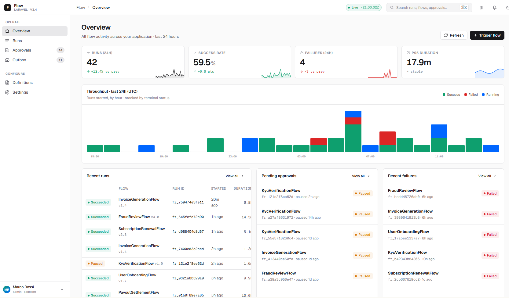
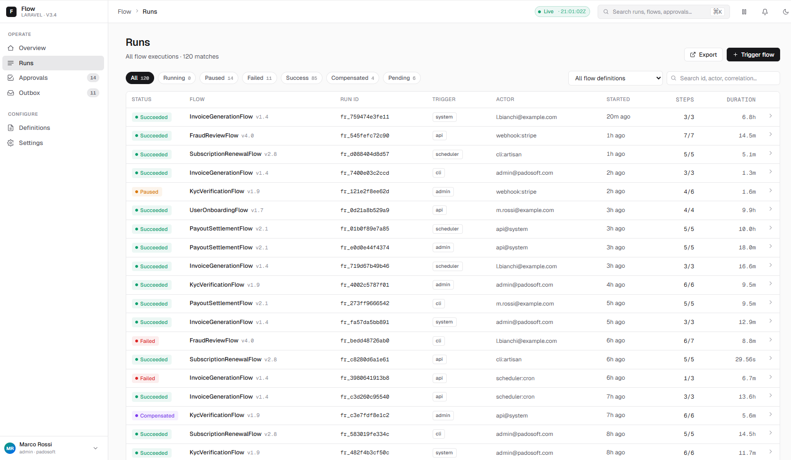
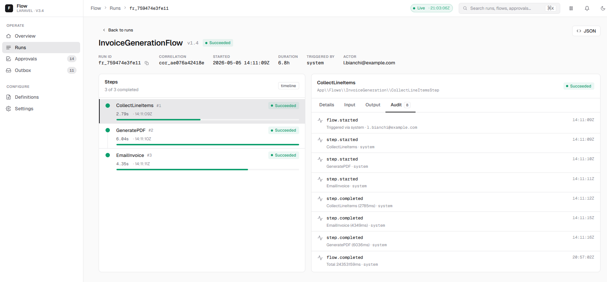
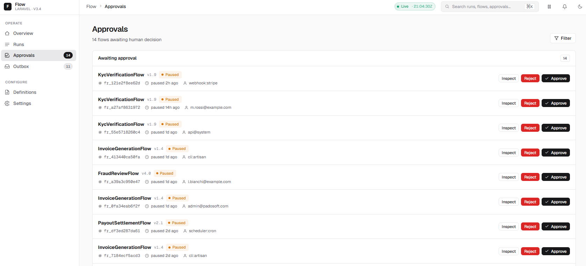
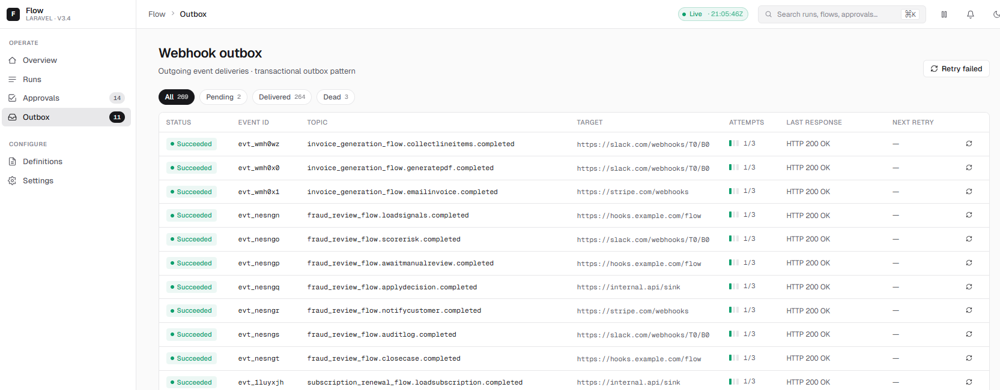
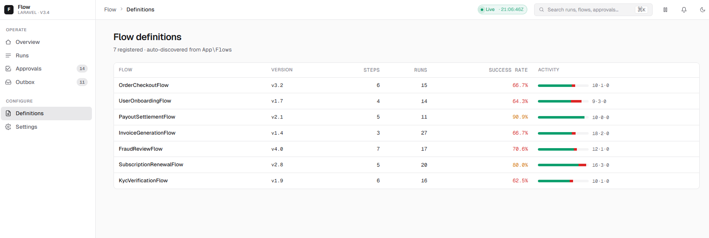
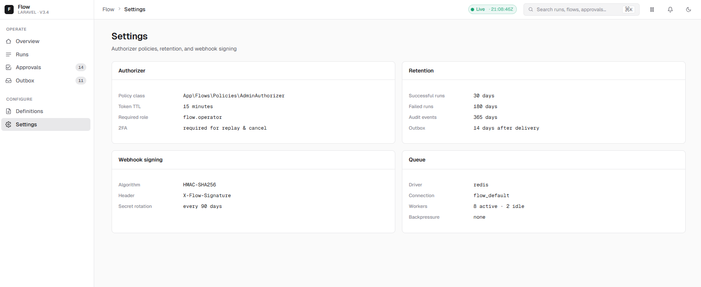

<div align="center">

# Laravel Flow Admin

**Pixel-perfect, dark-first admin panel for [`padosoft/laravel-flow`](https://github.com/padosoft/laravel-flow) — runs, approvals, outbox & definitions in one Blade + Alpine cockpit.**

[](https://github.com/padosoft/laravel-flow-admin/actions/workflows/ci.yml)
[](https://packagist.org/packages/padosoft/laravel-flow-admin)
[](https://packagist.org/packages/padosoft/laravel-flow-admin)
[](https://packagist.org/packages/padosoft/laravel-flow-admin)
[](https://laravel.com)
[](https://github.com/padosoft/laravel-flow-admin/actions)
[](https://github.com/padosoft/laravel-flow-admin/actions)
[](https://phpstan.org/)
[](https://laravel.com/docs/pint)
[](LICENSE)

[**🚀 Quick Start**](#-quick-start-5-minutes) ·
[**📸 Screenshots**](#-screenshots) ·
[**⚙️ Configuration**](#️-configuration) ·
[**🔒 Authorization**](#-authorization-mutations) ·
[**🤝 Contributing**](#-contributing)



</div>

---

## 📚 Table of Contents

- [✨ Why this package](#-why-this-package)
- [🎯 Features](#-features)
- [📸 Screenshots](#-screenshots)
- [📦 Requirements](#-requirements)
- [🚀 Quick Start (5 minutes)](#-quick-start-5-minutes)
- [📖 Step-by-Step Setup](#-step-by-step-setup)
  - [1. Install the underlying engine](#1-install-the-underlying-engine)
  - [2. Install the admin panel](#2-install-the-admin-panel)
  - [3. Publish assets and config](#3-publish-assets-and-config)
  - [4. Configure middleware & routes](#4-configure-middleware--routes)
  - [5. Wire your authorizer](#5-wire-your-authorizer)
  - [6. Visit the panel](#6-visit-the-panel)
- [⚙️ Configuration](#️-configuration)
- [🔒 Authorization (mutations)](#-authorization-mutations)
- [🎨 Customization](#-customization)
- [🧪 Demo Mode (no DB needed)](#-demo-mode-no-db-needed)
- [🗺️ Routes](#️-routes)
- [🏛️ Architecture](#️-architecture)
- [🤖 AI Vibe Coding Pack](#-ai-vibe-coding-pack)
- [⚖️ Comparison](#️-comparison)
- [🛣️ Roadmap](#️-roadmap)
- [✅ Quality Gates](#-quality-gates)
- [🤝 Contributing](#-contributing)
- [🔐 Security](#-security)
- [📜 License](#-license)
- [💜 Credits](#-credits)

---

## ✨ Why this package

[`padosoft/laravel-flow`](https://github.com/padosoft/laravel-flow) is intentionally **headless** — a deterministic, queue-driven workflow engine you can drop into any Laravel app.

**`laravel-flow-admin` is the operator console for it.** A production-style control plane for runs, approvals, outbox webhooks and configuration — without leaking the engine's internal namespaces into your app.

> Think **Horizon** for queues, **Pulse** for metrics — and **Flow Admin** for the lifecycle of long-running, multi-step business workflows.

---

## 🎯 Features

- 📊 **Overview dashboard** — KPI tiles, sparklines, recent runs, queue health, error rate.
- 🏃 **Runs index & detail** — filterable list, full timeline (timeline / Gantt / DAG), payload diff, retry/cancel actions.
- ✅ **Approvals inbox** — pending decisions with one-click approve / reject through your own authorizer.
- 📤 **Webhook outbox** — delivery state, replay failed jobs, inspect headers/payloads.
- 📋 **Flow definitions** — registered workflows, version, last activity at a glance.
- ⚡ **⌘K command palette** — jump anywhere in two keystrokes.
- 🎨 **Pixel-perfect dark + light themes** — persisted in cookie, switchable per user.
- 🛡️ **Deny-by-default authorizer** — every mutation goes through your `ActionAuthorizer`. No accidents.
- 🔁 **Auto-refreshing pages** — configurable polling (`/flow/api/live`).
- 🧱 **Adapter pattern** — `eloquent` for prod, `array` for demos / E2E (deterministic seed-42 fixtures).
- 🧪 **Battle-tested** — 106 PHPUnit tests, 7 Playwright scenarios (21 runs across Chromium / Firefox / WebKit).
- 📦 **Zero-coupling** — built on a public `Contracts\*` surface; engine internals stay `@internal`.

---

## 📸 Screenshots

<table>
<tr>
<td width="50%"><b>Overview &amp; KPIs</b><br/><sub>Live counters, run frequency, error rate, latest activity.</sub><br/><br/></td>
<td width="50%"><b>Runs</b><br/><sub>Filter by status, definition, time window. Sortable, paginated.</sub><br/><br/></td>
</tr>
<tr>
<td width="50%"><b>Run detail</b><br/><sub>Per-step timeline, JSON payloads, retry / cancel mutations.</sub><br/><br/></td>
<td width="50%"><b>Approvals</b><br/><sub>Pending decisions; resume / reject via your authorizer.</sub><br/><br/></td>
</tr>
<tr>
<td width="50%"><b>Webhook outbox</b><br/><sub>Delivery state, attempts, last error. Replay with one click.</sub><br/><br/></td>
<td width="50%"><b>Flow definitions</b><br/><sub>Registered flows, versions, last seen.</sub><br/><br/></td>
</tr>
<tr>
<td colspan="2"><b>Configuration</b><br/><sub>Effective settings: prefix, middleware, adapter, polling, theme, step viz default.</sub><br/><br/></td>
</tr>
</table>

---

## 📦 Requirements

| Requirement | Version |
| --- | --- |
| PHP | `^8.3` (also tested on 8.4) |
| Laravel | `^13.0` |
| [`padosoft/laravel-flow`](https://github.com/padosoft/laravel-flow) | `dev-main` (development-time — see note below) |
| Node.js (only if you want to rebuild assets) | `>=20` |
| Database | any Laravel-supported driver (or `array` adapter for demos) |

> 💡 You **do not** need Node.js to use this package. Pre-built assets ship inside the package and are publishable via `vendor:publish`.

> 🚧 **Development-time note**: this repo is mid-flight on the **Laravel Flow 2.0 program** (Macro E, Flow Studio UI). `padosoft/laravel-flow` has no v2 tagged release yet, so `composer.json` resolves it via a local `path` repository pointing at `../padosoft-laravel-flow` (a sibling checkout one directory up). That means `padosoft/laravel-flow-admin` is not `composer require`-able outside a monorepo-adjacent dev setup until core tags v2.0.0 — at which point this switches back to a normal SemVer range.

---

## 🚀 Quick Start (5 minutes)

```bash
# 1. Install both packages
composer require padosoft/laravel-flow-admin

# 2. Publish config + assets
php artisan vendor:publish --tag=flow-admin-config
php artisan vendor:publish --tag=flow-admin-assets

# 3. Run flow-engine migrations (from padosoft/laravel-flow)
php artisan migrate

# 4. Visit the admin panel
php artisan serve
# 👉  http://localhost:8000/flow
```

That's it. The panel is **read-only by default** (deny-all authorizer) so you can safely browse production data on day 1, then opt-in to mutations when you've wired your permission rules.

---

## 📖 Step-by-Step Setup

### 1. Install the underlying engine

`laravel-flow-admin` is a UI on top of `padosoft/laravel-flow`. If you don't already have it, install it first:

```bash
composer require padosoft/laravel-flow
php artisan vendor:publish --tag=flow-config
php artisan vendor:publish --tag=flow-migrations
php artisan migrate
```

This creates the `flow_runs`, `flow_run_nodes`, `flow_approvals`, `flow_webhook_outbox`, `flow_definitions` and related tables that this admin panel reads from.

> 📖 Full engine docs: [github.com/padosoft/laravel-flow](https://github.com/padosoft/laravel-flow)

### 2. Install the admin panel

```bash
composer require padosoft/laravel-flow-admin
```

The service provider is auto-discovered. Routes, views, config and migrations are loaded out-of-the-box from the package.

### 3. Publish assets and config

```bash
# Publish the config (config/flow-admin.php) — recommended
php artisan vendor:publish --tag=flow-admin-config

# Publish compiled CSS/JS to public/vendor/flow-admin (required for styling)
php artisan vendor:publish --tag=flow-admin-assets

# Optional: publish Blade views to resources/views/vendor/flow-admin (for customization)
php artisan vendor:publish --tag=flow-admin-views
```

> ⚠️ **Don't skip `flow-admin-assets`** in production. The panel relies on the published CSS/JS bundle.

### 4. Configure middleware & routes

By default the panel mounts at `/flow` and runs through `web,auth` middleware. Override with environment variables:

```env
FLOW_ADMIN_PREFIX=ops/flow
FLOW_ADMIN_MIDDLEWARE="web,auth,verified,can:access-flow-admin"
FLOW_ADMIN_THEME=dark
FLOW_ADMIN_STEP_VIZ=timeline
FLOW_ADMIN_POLLING_MS=4000
```

> 🛡️ If you set `FLOW_ADMIN_MIDDLEWARE=""` we **fall back to `['web']`** instead of leaving the panel unauthenticated. Setting it empty was a known footgun, so we close it explicitly.

### 5. Wire your authorizer

The panel ships with `DenyAllAuthorizer` so every mutation (resume, reject, replay, cancel, retry-webhook) is **blocked by default**. To enable mutations, implement your own:

```php
// app/Flow/AdminAuthorizer.php
namespace App\Flow;

use Padosoft\LaravelFlowAdmin\Contracts\ActionAuthorizer;

final class AdminAuthorizer implements ActionAuthorizer
{
    public function canResume(string $runId): bool
    {
        return auth()->user()?->can('flow.runs.resume') ?? false;
    }

    public function canCancel(string $runId): bool
    {
        return auth()->user()?->can('flow.runs.cancel') ?? false;
    }

    public function canApprove(string $approvalId): bool
    {
        return auth()->user()?->can('flow.approvals.act') ?? false;
    }

    public function canReject(string $approvalId): bool
    {
        return auth()->user()?->can('flow.approvals.act') ?? false;
    }

    public function canReplayWebhook(string $outboxId): bool
    {
        return auth()->user()?->can('flow.outbox.replay') ?? false;
    }
}
```

Bind it in `AppServiceProvider::register()`:

```php
use Padosoft\LaravelFlowAdmin\Contracts\ActionAuthorizer;
use App\Flow\AdminAuthorizer;

$this->app->bind(ActionAuthorizer::class, AdminAuthorizer::class);
```

…or set `'authorizer' => App\Flow\AdminAuthorizer::class` in `config/flow-admin.php`.

### 6. Visit the panel

```bash
php artisan serve
```

Open <http://localhost:8000/flow> and you should see the dashboard. Press **`⌘K`** (or `Ctrl+K`) anywhere to open the command palette.

---

## ⚙️ Configuration

All keys live in `config/flow-admin.php`. They are also overridable via environment variables.

| Key | Env | Default | Description |
| --- | --- | --- | --- |
| `prefix` | `FLOW_ADMIN_PREFIX` | `flow` | URI prefix for all routes (`/flow`, `/flow/runs`, …). |
| `middleware` | `FLOW_ADMIN_MIDDLEWARE` | `web,auth` | Comma-separated middleware stack. Empty/whitespace falls back to `['web']`. |
| `adapter` | `FLOW_ADMIN_ADAPTER` | `eloquent` | `eloquent` (prod) or `array` (deterministic demo fixtures). |
| `authorizer` | — | `DenyAllAuthorizer` | FQCN of your `ActionAuthorizer` implementation. |
| `polling_interval_ms` | `FLOW_ADMIN_POLLING_MS` | `4000` | Auto-refresh interval for live pages. |
| `theme_default` | `FLOW_ADMIN_THEME` | `dark` | `dark` or `light`. Per-user override stored in `flow_admin_theme` cookie. |
| `step_viz_default` | `FLOW_ADMIN_STEP_VIZ` | `timeline` | Default visualization on run detail: `timeline`, `gantt`, or `dag`. |

---

## 🔒 Authorization (mutations)

Every mutation route (resume, reject, replay, cancel, retry-webhook) consults your `ActionAuthorizer` **before** the controller runs. This is non-negotiable: there is no "global admin" bypass and no way to short-circuit the gate from a Blade view.

Public extension surface (semver-stable from `v0.1.0` →):

- `Padosoft\LaravelFlowAdmin\Contracts\ActionAuthorizer`
- `Padosoft\LaravelFlowAdmin\Contracts\ReadModel`
- `config/flow-admin.php` keys
- Publish tags: `flow-admin-config`, `flow-admin-views`, `flow-admin-assets`
- Route names: `flow-admin.*`

Everything under `Adapters\`, `Http\Controllers\`, `Support\`, `ViewModels\` is **internal** and may change between minor versions until v1.0.

---

## 🎨 Customization

### Override Blade views

```bash
php artisan vendor:publish --tag=flow-admin-views
```

Edit anything under `resources/views/vendor/flow-admin/`. Component slots and named layout sections are preserved across upgrades.

### Override CSS tokens

The published bundle exposes CSS custom properties for colors, radii, spacing and font sizing. Wrap the panel in a custom theme by overriding tokens:

```css
:root[data-flow-admin-theme="dark"] {
  --flow-admin-color-accent: #6366f1;
  --flow-admin-color-bg: #0b0d12;
}
```

### Switch theme programmatically

```http
POST /flow/theme
X-CSRF-TOKEN: …
theme=dark|light
```

---

## 🧪 Demo Mode (no DB needed)

For showcases, screenshots, or end-to-end tests you can bypass the database entirely:

```env
FLOW_ADMIN_ADAPTER=array
```

The `ArrayReadModelAdapter` produces deterministic fixtures (`seed=42`) so KPI numbers, run IDs and timelines are reproducible across screenshots and Playwright runs.

---

## 🗺️ Routes

All routes live under the configured prefix (default `/flow`) and the `flow-admin.*` route-name namespace.

| Method | URI | Name | Purpose |
| --- | --- | --- | --- |
| `GET` | `/` | `flow-admin.overview` | Dashboard |
| `GET` | `/runs` | `flow-admin.runs.index` | Runs list |
| `GET` | `/runs/{id}` | `flow-admin.runs.show` | Run detail + timeline |
| `GET` | `/approvals` | `flow-admin.approvals.index` | Approvals inbox |
| `GET` | `/outbox` | `flow-admin.outbox.index` | Webhook outbox |
| `GET` | `/definitions` | `flow-admin.definitions.index` | Registered flows |
| `GET` | `/settings` | `flow-admin.settings.index` | Effective configuration |
| `GET` | `/api/search` | `flow-admin.api.search` | ⌘K palette backend |
| `GET` | `/api/live` | `flow-admin.api.live` | Live polling JSON |
| `POST` | `/theme` | `flow-admin.theme.toggle` | Persist theme cookie |

---

## 🏛️ Architecture

```
HTTP request
   │
   ├─► routes/flow-admin.php  (prefix + middleware + name)
   │
   ├─► Http/Controllers/*Controller   ◄── thin: request → DTO → factory → view
   │       │
   │       ├─► Http/Requests/*Request   (validation, sorting, filtering DTOs)
   │       ├─► ViewModels/*Factory      (read-side view assembly)
   │       └─► Contracts/ActionAuthorizer (gate for any mutation)
   │
   ├─► Adapters/Eloquent | Array       (ReadModel implementations)
   │       └─► reads flow_* tables (via core's Dashboard\FlowDashboardReadModel) OR seed-42 fixtures
   │
   └─► resources/views/* + Alpine stores + Vite bundle
```

Design source-of-truth for the existing runs/approvals/outbox panel lives under `.design-source/project/` (pixel reference) and is enforced through Playwright visual regression on chromium / firefox / webkit. The Flow Studio UI (graph canvas, editor, live run monitor — Macro E, in progress) is being built against a separate template under `design/claude-design-template/`.

> ℹ️ **Search & list scope**: the `eloquent` adapter reads through core's `Dashboard\FlowDashboardReadModel`, which only exposes single-field, exact-match filters (no free-text search, no distinct-name listing). Runs search, flow filtering, and the definitions list are therefore computed over the **200 most recent runs** rather than full history — the same bound `Dashboard\Pagination::MAX_PER_PAGE` already imposes on a single page. Installs with more than 200 runs since the oldest match won't surface it in search; use direct DB access or a future `flow:*` Artisan command for full-history lookups. **KPIs and throughput buckets are not subject to this bound** — they page through every run in their rolling window (24h / 48h) rather than stopping at 200.

---

## 🤖 AI Vibe Coding Pack

This repository ships a contributor pack under `.claude/`:

- **Rules** — Laravel 13 defaults, admin-panel UX, query optimization, naming conventions, exception handling, logging security.
- **Skills** — orchestrators for `create-admin-interface`, `playwright-enterprise-tester`, `copilot-pr-review-loop`, `pre-push-self-review`, `test-count-readme-sync`.
- **Runbooks** — macro/subtask branch workflow used during initial implementation.

If you build with Claude Code or another agent, copy `.claude/` into your downstream project for a head start.

---

## ⚖️ Comparison

| Tool | Workflow runs lifecycle | Approvals UI | Webhook outbox | Drop-in for Laravel Flow |
| --- | :---: | :---: | :---: | :---: |
| **Laravel Flow Admin** | ✅ | ✅ | ✅ | ✅ |
| Laravel Horizon | ⚠️ queue/job only | ❌ | ❌ | ❌ |
| Laravel Pulse | ⚠️ app metrics | ❌ | ❌ | ❌ |
| Custom dashboard | depends | depends | depends | ⏳ slow to bootstrap |
| Temporal UI | ✅ (for Temporal) | ✅ | ⚠️ | ❌ |

---

## 🛣️ Roadmap

- [x] **v0.1** — core pages, eloquent + array adapters, theme cookie, ⌘K palette, Playwright matrix.
- [x] **v0.1.1** — public release hardening, README polish, GitHub release artifacts.
- [ ] **v2.0 (in progress)** — Flow Studio UI: read-only + editable graph canvas, versioning UI, live run monitor, working mutations, dry-run visualization, Advisor + AI Flow Builder UI. Tracked as Macro E of the Laravel Flow 2.0 program; ships once core (`padosoft/laravel-flow`) tags v2.0.0.
- [ ] **v0.2** — bulk actions on runs, saved filter presets, CSV/JSON export.
- [ ] **v0.3** — Pulse-style sparkline cards, alerting hooks.
- [ ] **v1.0** — frozen public surface, SemVer guarantees, downstream-stable Adapters.

---

## ✅ Quality Gates

Every push runs through this gate (matrix `php: 8.3, 8.4` × `laravel: 13`):

```bash
composer validate --strict --no-check-publish
composer format:test          # Laravel Pint
composer analyse              # PHPStan / Larastan level 8
composer test                 # PHPUnit — 106 tests, 592 assertions
npm run lint                  # ESLint flat config
npm run build                 # Vite build verification
npm run test:e2e              # Playwright on chromium + firefox + webkit
```

Latest local run: **106 tests / 592 assertions / 21 E2E runs passed** (7 Playwright scenarios × 3 browsers).

---

## 🤝 Contributing

PRs welcome! Please:

1. Open an issue first for non-trivial changes.
2. Branch from `main` as `task/<short-name>` or `subtask/<short-name>`.
3. Run the full local gate (above) before pushing.
4. Add tests — unit, feature, or Playwright depending on the change.
5. Update `docs/PROGRESS.md` if your PR closes a roadmap item, and `docs/LESSON.md` if you discover a reusable insight.

See [CONTRIBUTING.md](CONTRIBUTING.md) for the full workflow and [CODE_OF_CONDUCT.md](CODE_OF_CONDUCT.md).

---

## 🔐 Security

If you discover a security vulnerability, **please do not open a public issue.** Email **hello@padosoft.com** directly. See [SECURITY.md](SECURITY.md) for our disclosure policy.

---

## 📜 License

Apache-2.0 © [Padosoft](https://github.com/padosoft). See [LICENSE](LICENSE) for the full text.

---

## 💜 Credits

- **[Padosoft](https://github.com/padosoft)** — package author and maintainer.
- **[`padosoft/laravel-flow`](https://github.com/padosoft/laravel-flow)** — the headless workflow engine this panel operates.
- **[Laravel](https://laravel.com)**, **[Alpine.js](https://alpinejs.dev)**, **[Vite](https://vitejs.dev)**, **[Playwright](https://playwright.dev)** — the giants whose shoulders this is built on.

<div align="center">

**Made with ❤️ by [Padosoft](https://github.com/padosoft) — workflows are hard, the UI shouldn't be.**

[⬆ back to top](#laravel-flow-admin)

</div>
